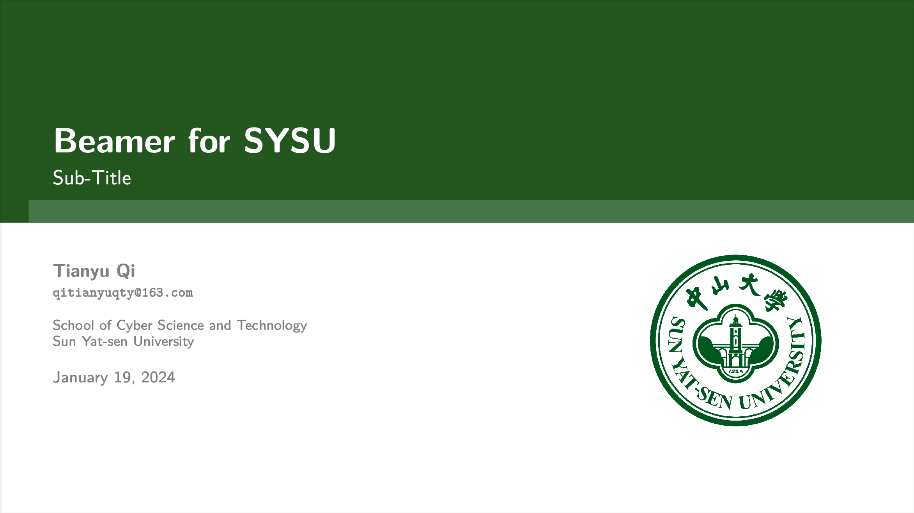
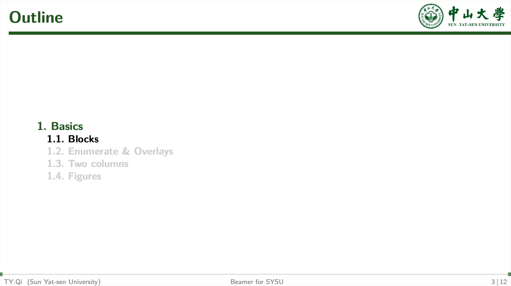
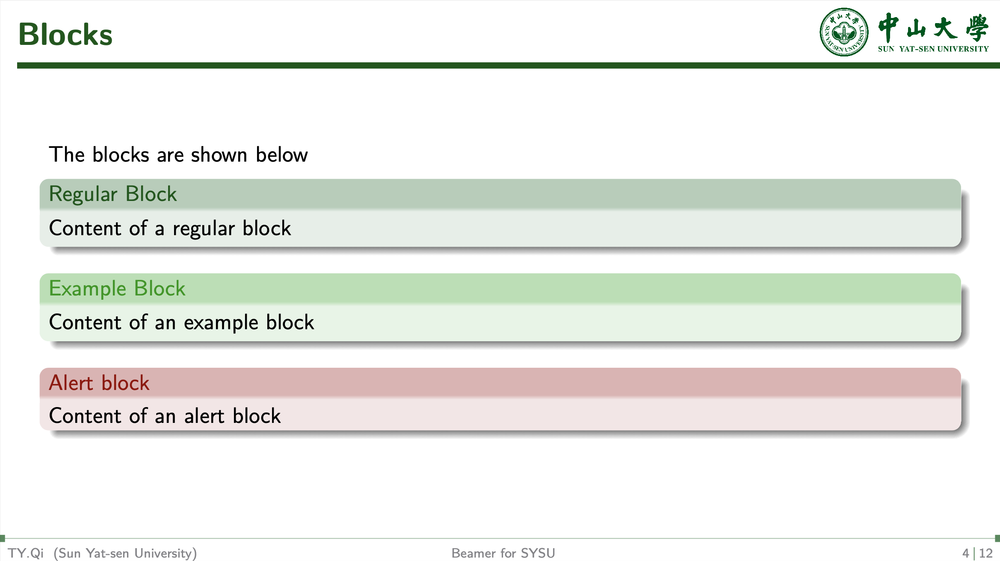
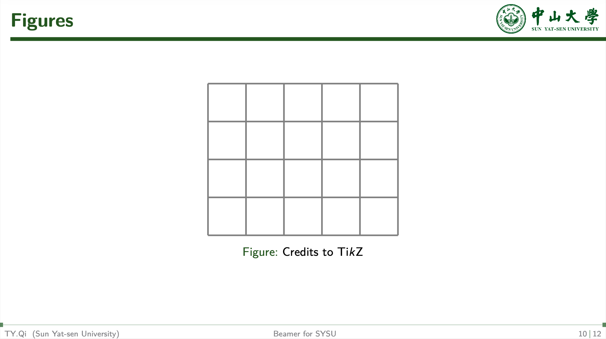

  

<h2>介绍</h2>

非官方Latex中山大学Beamer模板，支持双语，适用于中山大学学术科研报告，答辩等等，改编自Overleaf上的BIT Beamer模板与Beamer Temlate for BUCT。

An unofficial Latex Beamer template for Sun Yat-sen University, with support for bilingual content. Applicable to academic and research presentations at Sun Yat-sen University, including seminars and defenses, this document is adapted from the BIT Beamer template on Overleaf and the Beamer Template for BUCT.

  

  

  

  

<h2>链接Links</h2>

[Beamer for BIT](https://github.com/CharlieLeee/My_Beamer_Template)

[Beamer for BUCT](https://www.overleaf.com/latex/templates/beamer-for-buct/rndypbwvfxrp)
